# Formatting Examples
This document provides examples of various diagram types that can be created using PlantUML. Each example includes the basic syntax and structure for creating the diagram.
### **PlantUML Diagram Examples**
1. Sequence Diagram:
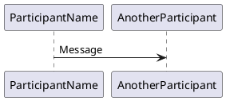
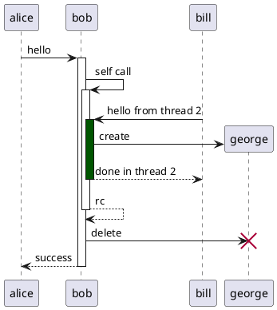

Use `->` for messages, `-->` for dotted arrows, and `<-` or `<--` for reverse arrows.

2. Use Case Diagram:
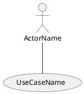
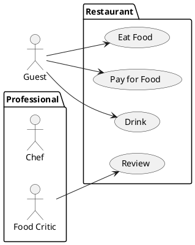

3. Class Diagram:
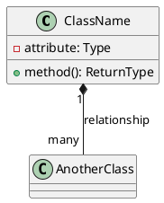

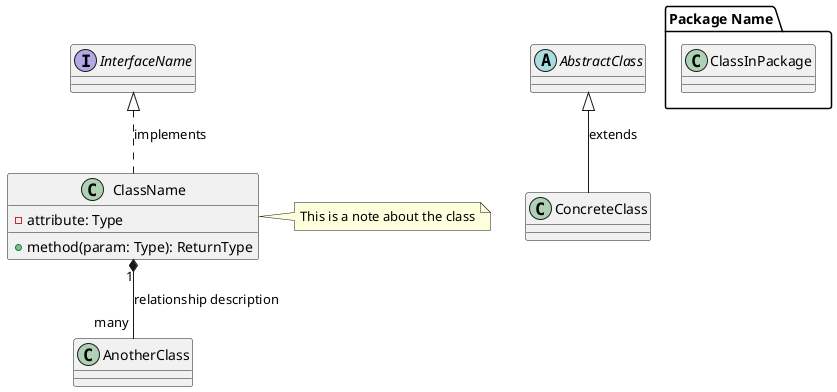

4. Object Diagram:
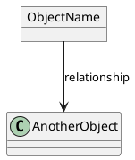
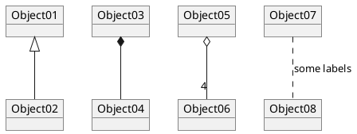

5. Activity Diagram (new syntax):
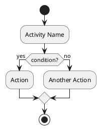
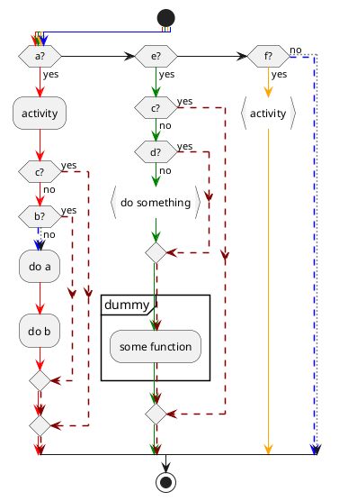

6. Component Diagram:
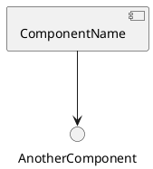

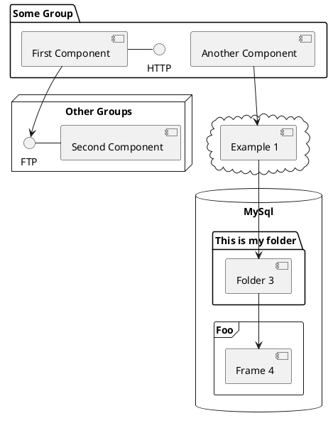

7. Deployment Diagram:
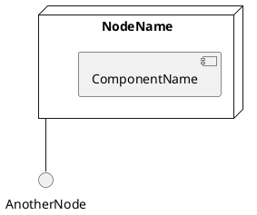
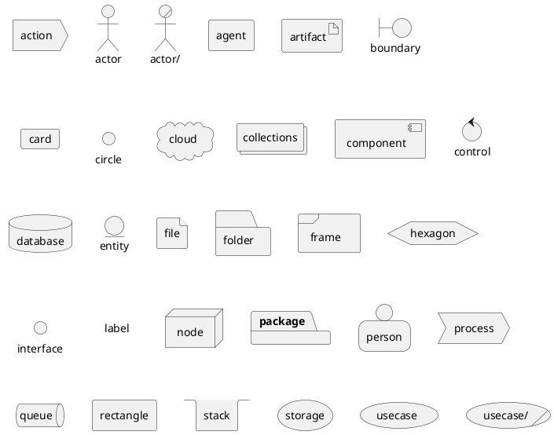

8. State Diagram:
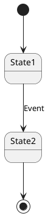
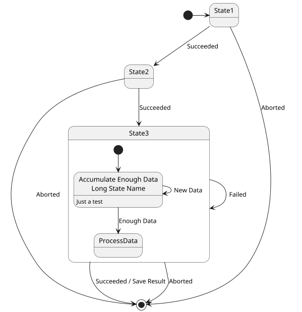

9. Timing Diagram:
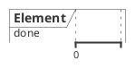

10.  JSON Data:
```plantuml
@startjson
{
  "key": "value"
}
@endjson
```

11.  YAML Data:


12.  Network Diagram (nwdiag):
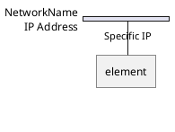

13.  Wireframe Graphical Interface (SALT):
```plantuml
@startsalt
{+
  Button Label | Field Name
}
@endsalt
```

14.  Archimate Diagram:
```plantuml
@startuml
archimate #Business "Label" as Element
Element -> AnotherElement
@enduml
```
15.  Ditaa Diagram:
```plantuml
@startditaa
+--------+        +--------+
|        |        |        |
|  Box1  +------->+  Box2  |
|        |        |        |
+--------+        +--------+
@endditaa
```

16.  Gantt Diagram:
```plantuml
@startgantt
Project starts 2020-07-01
[Prototype design] starts 2020-07-01
[Test prototype] starts 2020-07-16
[Prototype design] ends 2020-07-15
[Test prototype] ends 2020-07-25

@endgantt
```

17.  MindMap Diagram:
```plantuml
@startmindmap
* Central Idea
** Branch1
*** SubBranch1
** Branch2
@endmindmap
```

18.  Work Breakdown Structure (WBS):
```plantuml
@startwbs
* Project
** Task1
*** Subtask1
** Task2
@endwbs
```

19.  Entity Relationship Diagram:
```plantuml
@startuml
entity EntityName {
  * PrimaryKey
  attribute: Type
}
EntityName }|..|| AnotherEntity
@enduml
```

For all diagrams, you can use:
- `skinparam` to customize colors and fonts
- Comments with `'` or `/' ... '/`
- Notes with `note left`, `note right`, etc.
- Titles with `title TitleText`
- Legends with `legend` and `endlegend`

Remember that these are just basic examples. Each diagram type has more advanced features and options available in [PlantUML](www.plantuml.com).
