# NL2BP: Natural Language to UML Blueprint | 自然语言到UML蓝图

<div align="center">

[English](#english) | [中文](#中文)

[](https://opensource.org/licenses/MIT)
[](https://crewai.com/)
[](https://plantuml.com/)

**🚀 从自然语言需求到UML蓝图的AI工作流程设计**

</div>

---

## English

### 🎯 AI-Driven Development Workflow Design

This project provides workflow designs and prompt templates for transforming natural language requirements into UML blueprints through AI agent collaboration. It includes two complementary approaches: single-agent role-switching and multi-agent collaboration patterns.

#### ✨ What This Project Provides

- 📋 **Workflow Design Templates** - Detailed process flows for AI-driven development
- 🤖 **Agent Role Definitions** - Comprehensive prompt templates for different specialist roles
- 📊 **UML Generation Guides** - Structured approaches to PlantUML diagram creation
- 🔄 **Process Documentation** - Complete workflow specifications and best practices
- 💡 **Implementation Patterns** - Both single-agent and multi-agent collaboration models

#### 🏗️ Two Workflow Approaches

**Single-Agent Workflow:**


| 🎯 Single-Agent Approach | 🔄 Multi-Agent Approach |
|:---:|:---:|
| One AI agent switches between 7 specialized roles | 9 specialized AI agents collaborate in parallel |
| Sequential role-based execution | Concurrent multi-agent coordination |
| Suitable for focused, linear development | Ideal for complex, agile development |
| [📖 Learn More](./workflow_single_agent/) | [📖 Learn More](./workflow_multi_agent/) |

**Multi-Agent Workflow:**


#### 🎭 Agent Roles & Responsibilities

**Single-Agent System (7 Roles):**
- 📝 **Requirements Analyst** - Natural language to structured requirements
- 🏗️ **System Architect** - Technical architecture design
- 📊 **Blueprint Designer** - PlantUML diagram generation
- 💻 **Coder** - Implementation guidance
- 🔍 **Code Reviewer** - Quality assurance patterns
- 🚀 **Deployer & Debugger** - Deployment and testing workflows
- 🛠️ **Code Critic** - Problem diagnosis methodologies

**Blueprint Designer Profile:**


**Multi-Agent System (9 Agents):**
- 🏗️ **System Design Agent** - Architecture planning
- 📋 **Requirement Analysis Agent** - User story creation
- 📊 **Blueprint Design Agent** - Visual system design
- 🎨 **Frontend Design Agent** - UI/UX patterns
- ⚙️ **Backend Design Agent** - Server-side architecture
- 📦 **Version Control Agent** - Code versioning strategies
- 📈 **Agile Dashboard Agent** - Progress tracking methods
- 🔄 **Feedback Planning Agent** - Iteration planning
- 👤 **Human Collaborator** - User interaction patterns

#### 🎨 Generated Examples Gallery

**English UML Examples:**

<div align="center">

| System Architecture | API Sequence | Use Case Diagram |
|:---:|:---:|:---:|
| 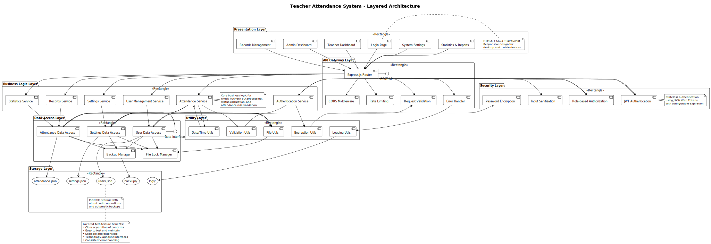 | 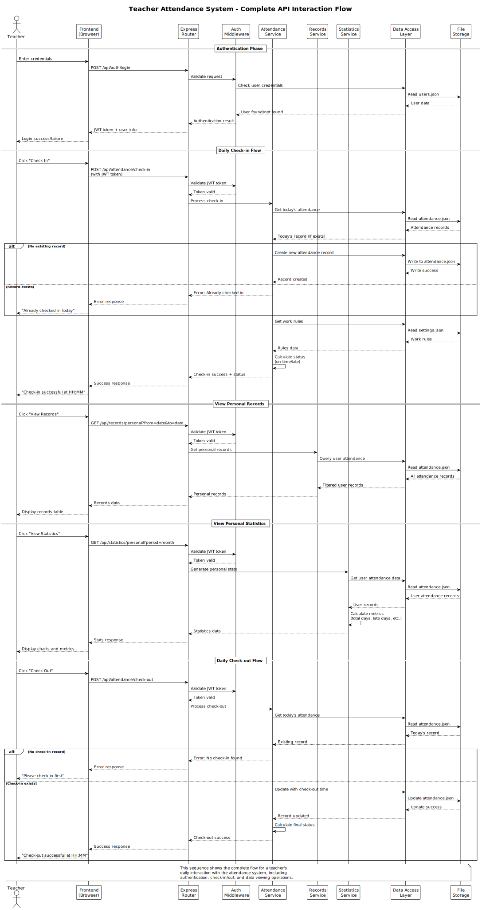 | 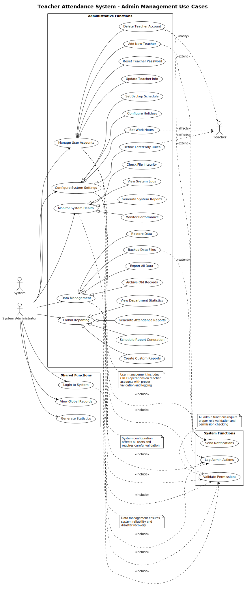 |

| Component Diagram | Data Flow | Authentication Flow |
|:---:|:---:|:---:|
| 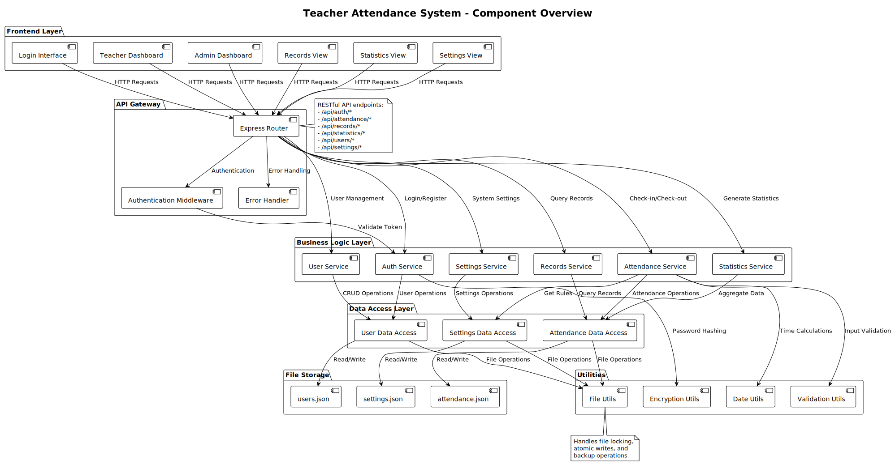 | 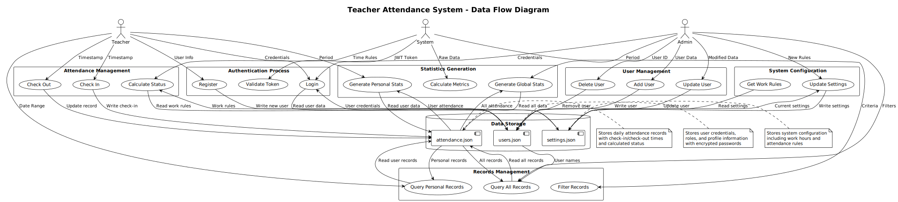 | 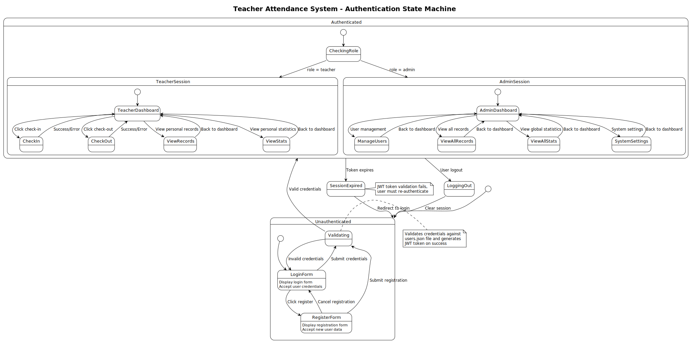 |

</div>

#### 🚀 Quick Start

**For Single-Agent Workflow (Prompt Templates):**
1. **Use Blueprint Agent Prompts**:
   ```bash
   cd workflow_single_agent/
   # Use prompt templates from role_prompts/rules-blueprintdesign/
   # Core prompt guide in agent_profile/BlueprintWriter_Profile.md
   ```

2. **Apply Prompt Templates**:
   - Use Blueprint Agent prompt from `role_prompts/rules-blueprintdesign/`
   - Follow formatting examples in `role_prompts/rules-blueprintdesign/`
   - Input your requirements with the prompt template to any LLM

**For Multi-Agent Workflow (CrewAI Framework):**
1. **Install CrewAI**:
   ```bash
   pip install crewai
   ```

2. **Use Our Implementation Pattern**:
   ```bash
   # Reference our CrewAI implementation structure
   cd workflow_multi_agent/crewai_code/
   # Adapt the agent definitions and workflow patterns
   ```

#### 🔥 Why Use NL2BP?

- ✅ **Complete Workflow Design** - End-to-end process templates
- ✅ **Ready-to-Use Prompts** - Tested prompt templates for each role
- ✅ **Flexible Architecture** - Two workflow options to choose from
- ✅ **Professional Output** - Enterprise-grade diagram generation guides
- ✅ **Implementation Patterns** - Both theoretical and practical approaches

---

## 中文

### 🎯 AI驱动的开发工作流程设计

本项目提供了通过AI代理协作将自然语言需求转化为UML蓝图的工作流程设计和提示模板。包含两种互补的方法：单代理角色切换和多代理协作模式。

#### ✨ 项目提供内容

- 📋 **工作流程设计模板** - 详细的AI驱动开发流程
- 🤖 **代理角色定义** - 不同专业角色的完整提示模板
- 📊 **UML生成指南** - PlantUML图表创建的结构化方法
- 🔄 **流程文档** - 完整的工作流程规范和最佳实践
- 💡 **实现模式** - 单代理和多代理协作模型

#### 🏗️ 两种工作流程方法

**单代理工作流程：**


| 🎯 单代理方法 | 🔄 多代理方法 |
|:---:|:---:|
| 一个AI代理切换7个专业角色 | 9个专业AI代理并行协作 |
| 顺序式角色执行 | 并发多代理协调 |
| 适合专注的线性开发 | 适合复杂的敏捷开发 |
| [📖 了解更多](./workflow_single_agent/) | [📖 了解更多](./workflow_multi_agent/) |

**多代理工作流程：**


#### 🎭 代理角色与职责

**单代理系统（7个角色）：**
- 📝 **需求分析师** - 自然语言转结构化需求
- 🏗️ **架构设计师** - 技术架构设计
- 📊 **蓝图设计师** - PlantUML图表生成
- 💻 **编码工程师** - 实现指导
- 🔍 **代码审查员** - 质量保证模式
- 🚀 **部署调试员** - 部署与测试工作流程
- 🛠️ **代码诊断师** - 问题诊断方法论

**蓝图设计师配置：**


**多代理系统（9个代理）：**
- 🏗️ **系统设计代理** - 架构规划
- 📋 **需求分析代理** - 用户故事创建
- 📊 **蓝图设计代理** - 可视化系统设计
- 🎨 **前端设计代理** - UI/UX模式
- ⚙️ **后端设计代理** - 服务端架构
- 📦 **版本控制代理** - 代码版本管理策略
- 📈 **敏捷看板代理** - 进度跟踪方法
- 🔄 **反馈规划代理** - 迭代规划
- 👤 **人类协作者** - 用户交互模式

#### 🎨 生成示例画廊

**中文UML示例：**

<div align="center">

| 学生图书管理组件图 | MVC架构流程图 | 数据库架构图 |
|:---:|:---:|:---:|
| 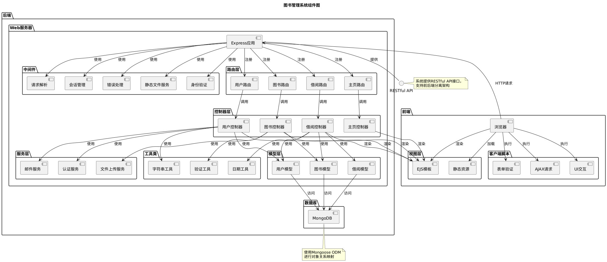 | 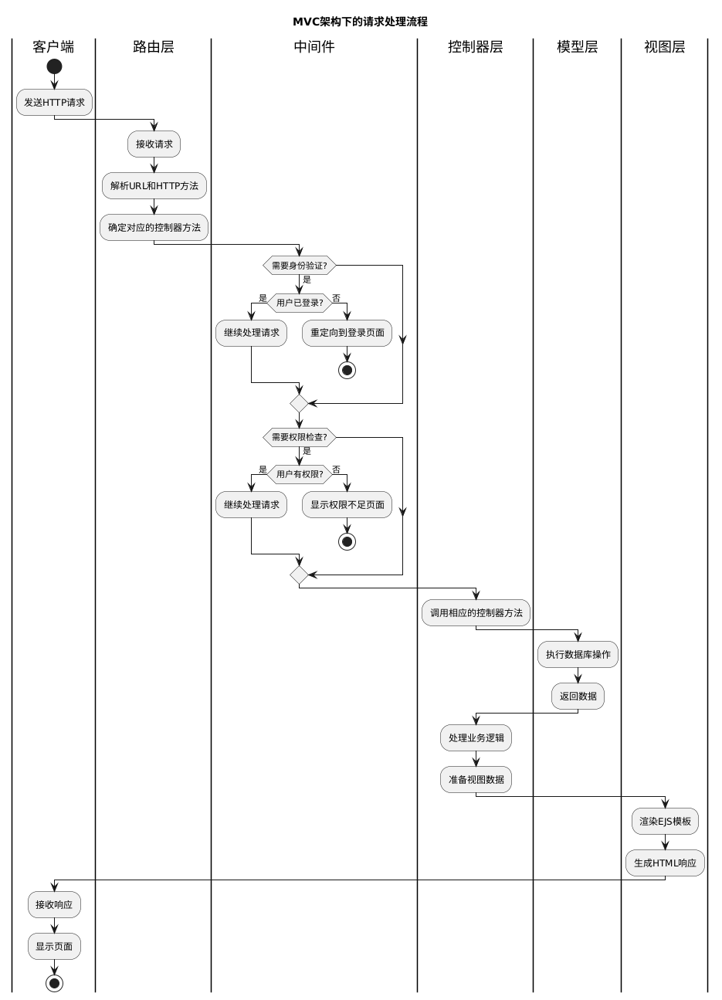 | 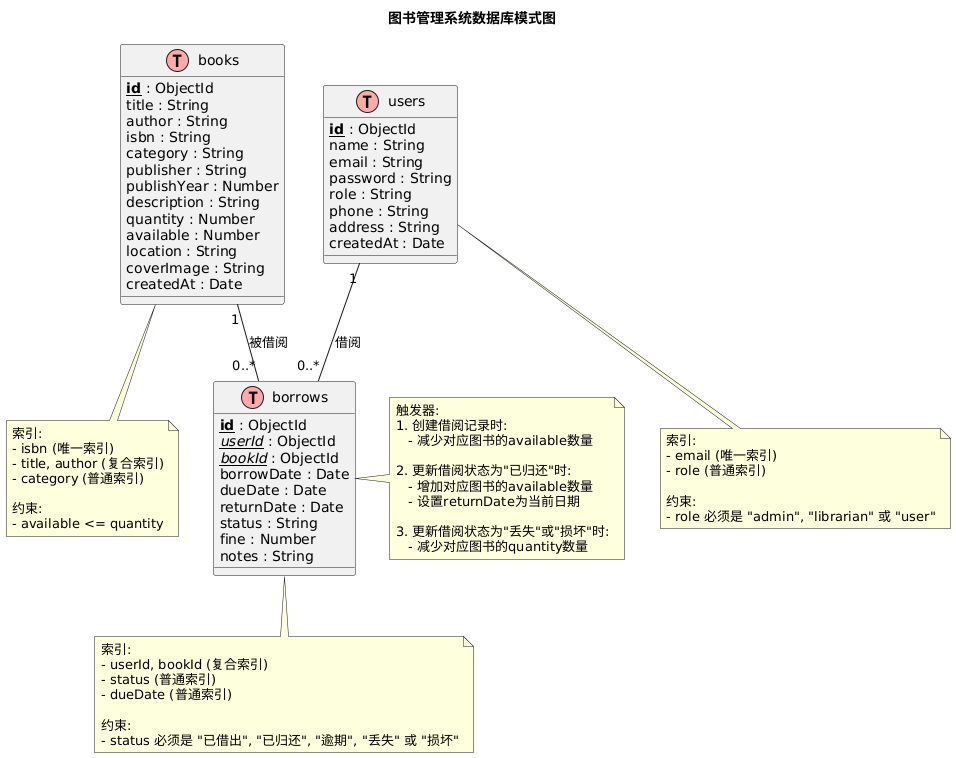 |

| 学生成绩模块图 | 借阅时序图 | 类图设计 |
|:---:|:---:|:---:|
| 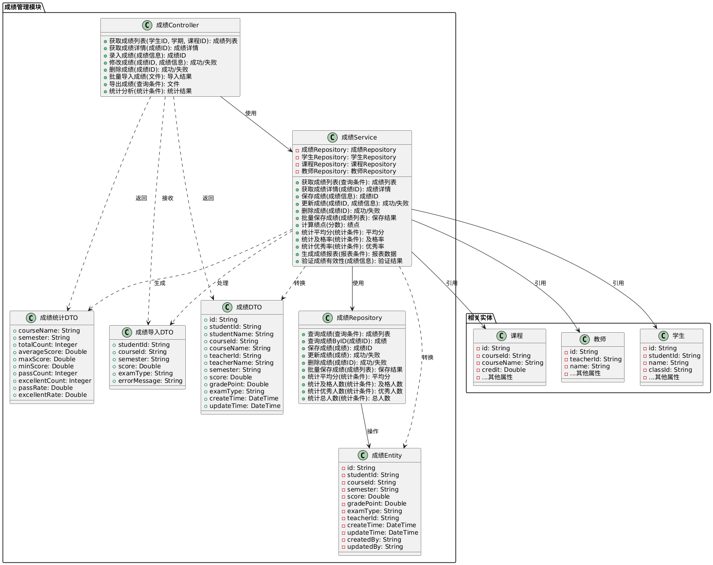 | 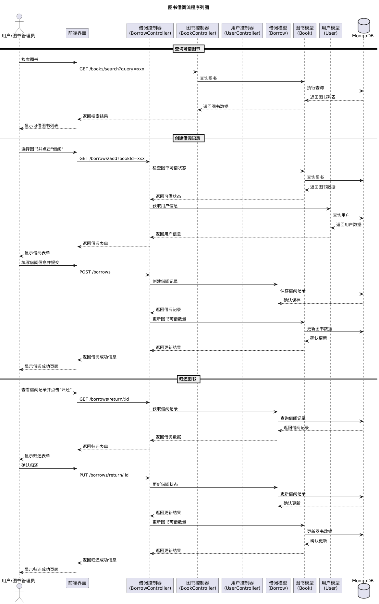 | 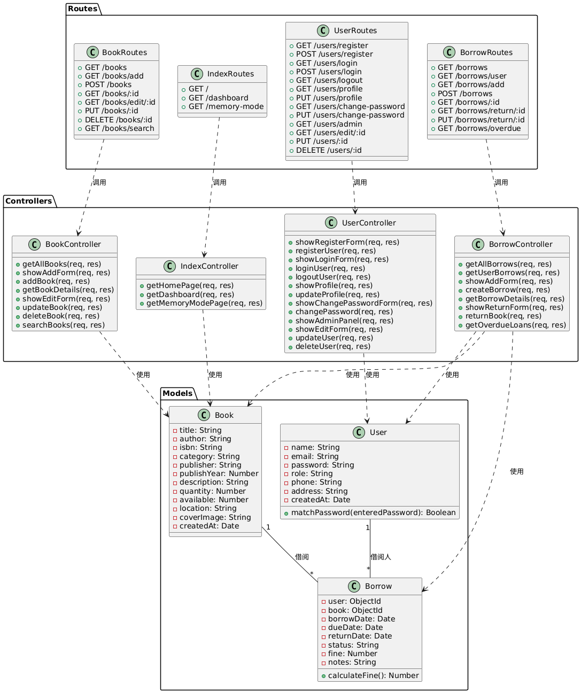 |

</div>

#### 🚀 快速开始

**单代理工作流程（提示模板）：**
1. **使用蓝图代理提示**：
   ```bash
   cd workflow_single_agent/
   # 使用 role_prompts/rules-blueprintdesign/ 中的提示模板
   # 核心提示指南在 agent_profile/BlueprintWriter_Profile.md
   ```

2. **应用提示模板**：
   - 使用 `role_prompts/rules-blueprintdesign/` 中的蓝图代理提示
   - 参考 `role_prompts/rules-blueprintdesign/` 中的格式示例
   - 将您的需求和提示模板输入到任何LLM中

**多代理工作流程（CrewAI框架）：**
1. **安装CrewAI**：
   ```bash
   pip install crewai
   ```

2. **使用我们的实现模式**：
   ```bash
   # 参考我们的CrewAI实现结构
   cd workflow_multi_agent/crewai_code/
   # 适配代理定义和工作流程模式
   ```

#### 🔥 为什么使用NL2BP？

- ✅ **完整工作流程设计** - 端到端流程模板
- ✅ **即用提示模板** - 经过测试的各角色提示模板
- ✅ **灵活架构** - 两种工作流程选择
- ✅ **专业输出** - 企业级图表生成指南
- ✅ **实现模式** - 理论与实践相结合的方法

#### 📦 项目结构

```
NL2BP/
├── workflow_single_agent/          # 单代理多角色系统
│   ├── role_prompts/              # 角色提示规则
│   ├── agent_profile/             # 代理配置文件
│   └── workflow_pic/              # 工作流程图
├── workflow_multi_agent/          # 多代理协作系统
│   ├── crewai_code/              # CrewAI实现模式
│   └── workflow_pic/              # 多代理流程图
├── UML_examples_en/               # 英文UML示例
├── UML_examples_zh/               # 中文UML示例
└── README.md                      # 本文档
```

#### 🌟 核心特点

**项目优势：**
- 🚀 **结构化方法** - 系统化的开发流程设计
- 🎯 **实用模板** - 可直接使用的提示模板
- 📊 **可视化指导** - 专业UML图表生成方法
- 🔄 **敏捷支持** - 迭代开发流程设计

**设计创新点：**
- 🧠 **智能角色设计** - 单代理多专业能力模板
- 🤝 **多代理协作模式** - 并行处理复杂任务的框架
- 📈 **流程监控设计** - 全程进度跟踪方法
- 🔧 **版本管理模式** - 智能代码版本控制策略

#### 📋 使用说明

本项目主要提供：
- **工作流程设计**：详细的开发流程规范和最佳实践
- **提示模板**：各角色的专业提示词模板，可直接用于任何LLM
- **实现参考**：CrewAI框架下的多代理协作实现模式
- **示例展示**：生成的UML图表示例和格式规范

**注意**：本项目重点在于提供工作流程设计和提示模板，而非完整的可执行代码实现。用户可以根据提供的模板和流程设计，结合自己的技术栈进行具体实现。

---

<div align="center">

### 🚀 用AI重新设计软件开发流程！

**[单代理工作流程](./workflow_single_agent/) | [多代理工作流程](./workflow_multi_agent/) | [示例画廊](#示例画廊)**

</div>
